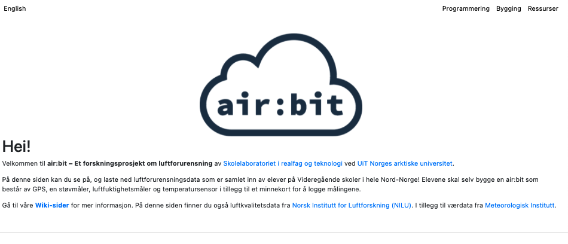
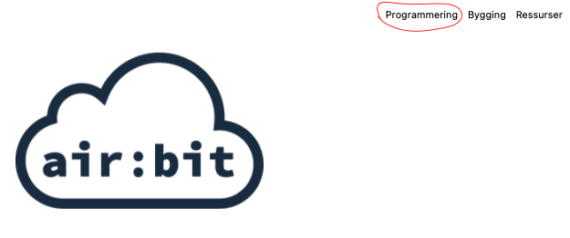
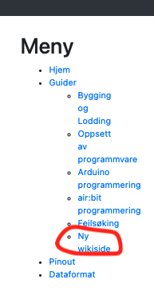

# github_pages

Github pages implementation of the airbit page.


```bash
npm install # to install dependenciesA
```
```bash
npm run start # to start development server, located at localhost:8080
```
```bash
npm run deploy # to build webpacks and deploy to this repos /github_pages branch.
```

Easily maintainable markdown wiki,

When you first start the development server you will see:

In order to go to the wiki go to:




In order to add a new page we have to add it to the sidebar.
Go to [_Sidebar.md](src/pages/_Sidebar.md) and add:

```diff

# Meny

	- [Hjem][hjem]	
	- [Guider][guides]
		- [Bygging og Lodding][building]
		- [Oppsett av programmvare][setup]
 		- [Arduino programmering][intro-programming]
		- [air:bit programmering][airbit-programming]
 	 	- [Feilsøking][error-debugging]
+		- [Ny wikiside][new-wikipage]
	- [Pinout][pinout]
	- [Dataformat][data-format]

[hjem]: /wiki/Home
[guides]: /wiki/airbit-Guider
[building]: /wiki/Guide-Bygging-og-Lodding
[setup]: /wiki/Guide-Oppsett-for-programmering
[intro-programming]: /wiki/Introduksjon-til-Arduino-programmering
[airbit-programming]: /wiki/airbit-Programmering
[error-debugging]: /wiki/Feilsøking-av-programmeringsfeil
[pinout]: /wiki/airbit-Pinout
[data-format]: /wiki/Dataformat
[ex-sd]: /wiki/airbit-memory-card-test
[ex-allsensors]: /wiki/airbit-all-sensors
+[new-wikipage]: /wiki/new-page

```

And it will then give you something like this on localhost:8080:

We now have a functional link that can be used to route to a new wiki page.
If the link is clicked now, we will be served an empty page.

```bash
touch src/pages/new-page.md 
```
And then you may add the content there.
```markdown
<!-- in src/pages/new-page.md -->
## Her er en ny side
```

Important to note that the name of the file should be what you referenced to in the sidebar. 

When this is done, it will look like this:


